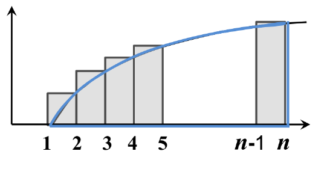
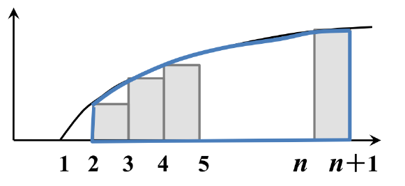
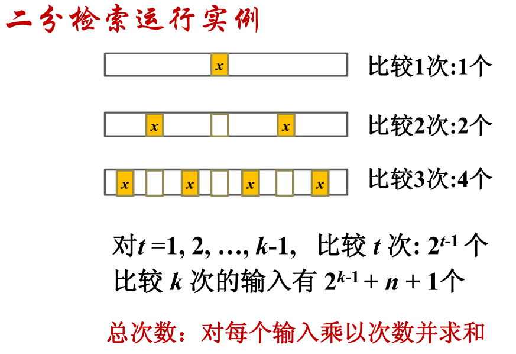
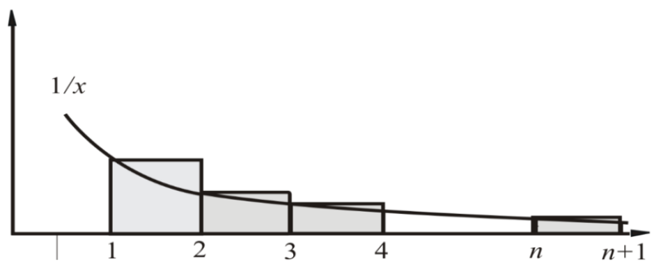
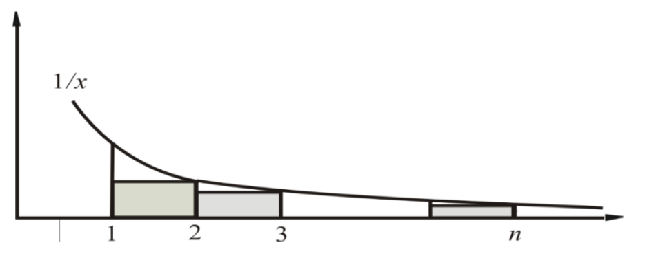

# 算法分析与复杂性理论

## 1. 函数渐进的界

### 1.1 大 $O$ 符号

- **定义：**

  设 $f$ 和 $g$ 是定义域为自然数集N上的函数。**若存在正数 $c$ 和 $n_0$ ，使得对于一切 $n > n_0$ 有 $0 \le f(n) \le cg(n)$** 成立，则称 **$f(n)$ 的渐进上界是 $g(n)$**，记作：

  $f(n) = O(g(n))$

  > [自然数]([https://baike.baidu.com/item/%E8%87%AA%E7%84%B6%E6%95%B0/385394?fr=aladdin](https://baike.baidu.com/item/自然数/385394?fr=aladdin))：自然数是指用以计量事物的件数或表示事物次序的数。即用数码0，1，2，[3](https://baike.baidu.com/item/3/5833)，4……所表示的数。自然数由0开始，一个接一个，组成一个无穷的集体。自然数有有序性，无限性。分为偶数和奇数，合数和质数等。

- **说明：**

  - $f(n) = O(g(n))$，$f(n)$ 的阶不高于 $g(n)$ 的阶；
  - 可能存在多个正数 $c$ ，只要指出一个即可；
  - 对前面有限多个值可以不满足不等式；
  - 常数函数可以写作 $O(1)$

- **栗子：**
  设 $f(n) = n^2 + n$，则：

  - $f(n) = O(n^2)$，取 $c = 2, n_0 = 1$ 即可；
  - $f(n) = O(n^3)$，取 $c = 1, n_0 = 2$ 即可；

### 1.2 大 $\Omega$ 符号

- **定义：**

  设 $f$ 和 $g$ 是定义域为自然数集N上的函数。**若存在正数 $c$ 和 $n_0$ ，使得对于一切 $n > n_0$ 有 $0 \le cg(n) \le f(n)$** 成立，则称 **$f(n)$ 的渐进下界是 $g(n)$**，记作：

  $f(n) = \Omega(g(n))$

- **说明：**

  - $f(n) = \Omega(g(n))$，$f(n)$ 的阶不低于 $g(n)$ 的阶；
  - 可能存在多个正数 $c$ ，只要指出一个即可；
  - 对前面有限多个值可以不满足不等式；

- **栗子：**

  设 $f(n) = n^2 + n$，则：

  - $f(n) = \Omega(n^2)$，取 $c = 1, n_0 = 1$ 即可；
  - $f(n) = \Omega(100n)$，取 $c = \frac{1}{100}, n_0 = 1$ 即可；

### 1.3 小 $o$ 符号

- **定义：**

  设 $f$ 和 $g$ 是定义域为自然数集N上的函数。**若对于任意正数 $c$ 都存在 $n_0$**，**使得对于一切 $n > n_0$ 有 $0 \le f(n) \le cg(n)$** 成立，则记作：

  $f(n) = o(g(n))$

- **说明：**

  - $f(n) = o(g(n))$，$f(n)$ 的阶低于 $g(n)$ 的阶；
  - 对不同的正数 $c$，$n_0$ 不一样，$c$ 越小 $n_0$ 越大；
  - 对前面有限多个值可以不满足不等式；

- **栗子：**

  设 $f(n) = n^2 + n$，则：$f(n) = o(n^3)$

  证：

  - 当 $c \ge 1$ 时显然成立，只要取 $n_0 = 2$，$n^2 + n < cn^3$；

  - 当 $0 < c < 1$ 时，取 $n_0 = \left \lceil \frac{2}{c} \right \rceil$ 即可，因为当 $n \ge n_0$：

    $cn \ge cn_0 > 2$

    $n^2 + n < 2n^2 < cn^3$

### 1.4 小 $\omega$ 符号

- **定义：**

  设 $f$ 和 $g$ 是定义域为自然数集N上的函数。**若对于任意正数 $c$ 都存在 $n_0$**，**使得对于一切 $n > n_0$ 有 $0 \le cg(n) \le f(n) $** 成立，则记作：

  $f(n) = \omega(g(n))$

- **说明：**

  - $f(n) = o(g(n))$，$f(n)$ 的阶高于 $g(n)$ 的阶；
  - 对不同的正数 $c$，$n_0$ 不一样，$c$ 越小 $n_0$ 越大；
  - 对前面有限多个值可以不满足不等式；

### 1.5 $\Theta$ 符号

- **定义：**

  若 $f(n) = O(g(n))$ 且 $f(n) = \Omega(g(n))$，则记作：

  $f(n) = \Theta(g(n))$

- **说明：**

  - $f(n)$ 的阶与 $g(n)$ 的阶相同
  - 对前面有限多个值可以不满足条件；

|          |                             定义                             |                             说明                             |
| :------: | :----------------------------------------------------------: | :----------------------------------------------------------: |
|   $O$    | 设 $f$ 和 $g$ 是定义域为自然数集N上的函数。**若存在正数 $c$ 和 $n_0$ ，使得对于一切 $n > n_0$ 有 $0 \le f(n) \le cg(n)$** 成立，则称 **$f(n)$ 的渐进上界是 $g(n)$**，记作：$f(n) = O(g(n))$ | $f(n) = O(g(n))$，$f(n)$ 的阶不高于 $g(n)$ 的阶； 可能存在多个正数 $c$ ，只要指出一个即可； 对前面有限多个值可以不满足不等式； 常数函数可以写作 $O(1)$ |
| $\Omega$ | 设 $f$ 和 $g$ 是定义域为自然数集N上的函数。**若存在正数 $c$ 和 $n_0$ ，使得对于一切 $n > n_0$ 有 $0 \le cg(n) \le f(n)$** 成立，则称 **$f(n)$ 的渐进下界是 $g(n)$**，记作：$f(n) = \Omega(g(n))$ | $f(n) = \Omega(g(n))$，$f(n)$ 的阶不低于 $g(n)$ 的阶； 可能存在多个正数 $c$ ，只要指出一个即可； 对前面有限多个值可以不满足不等式； |
|   $o$    | 设 $f$ 和 $g$ 是定义域为自然数集N上的函数。**若对于任意正数 $c$ 都存在 $n_0$**，**使得对于一切 $n > n_0$ 有 $0 \le f(n) \le cg(n)$** 成立，则记作：$f(n) = o(g(n))$ | $f(n) = o(g(n))$，$f(n)$ 的阶低于 $g(n)$ 的阶； 对不同的正数 $c$，$n_0$ 不一样，$c$ 越小 $n_0$ 越大； 对前面有限多个值可以不满足不等式； |
| $\omega$ | 设 $f$ 和 $g$ 是定义域为自然数集N上的函数。**若对于任意正数 $c$ 都存在 $n_0$**，**使得对于一切 $n > n_0$ 有 $0 \le cg(n) \le f(n) $** 成立，则记作：$f(n) = \omega(g(n))$ | $f(n) = o(g(n))$，$f(n)$ 的阶高于 $g(n)$ 的阶； 对不同的正数 $c$，$n_0$ 不一样，$c$ 越小 $n_0$ 越大； 对前面有限多个值可以不满足不等式； |
| $\Theta$ | 若 $f(n) = O(g(n))$ 且 $f(n) = \Omega(g(n))$，则记作：$f(n) = \Theta(g(n))$ | $f(n)$ 的阶与 $g(n)$ 的阶相同 对前面有限多个值可以不满足条件； |

## 2. 函数渐进界的定理

### 2.1 定理1：`Knowledge`

- **定理内容：** 

  设 $f$ 和 $g$ 是定义域为自然数集合的函数。

  - 如果 $\lim_{n \to \infty}\frac{f(n)}{g(n)}$ 存在，并且等于某个常数 $c > 0$ ，那么：

    $f(n) = \Theta(g(n))$

  - 如果 $\lim_{n \to \infty}\frac{f(n)}{g(n)} = 0$ ，那么：

    $f(n) = o(g(n))$

  - 如果 $\lim_{n \to \infty}\frac{f(n)}{g(n)} = +\infty$ ，那么：

    $f(n) = \omega(g(n))$ 

- **栗子：**

  设 $f(n) = \frac{1}{2}n^2 - 3n$，证明 $f(n) = \Theta(n^2)$ 

  证：因为

  ​	$\lim_{n \to \infty}\frac{f(n)}{n^2} = \lim_{n \to \infty}\frac{\frac{1}{2}n^2 - 3n}{n^2} = \frac{1}{2}$

  根据定理1，有 $f(n) = \Theta(n^2)$

- **根据定理1，得到的一些重要的结论：**

  - $n^d = o(r^n), r > 1, d > 0$ => **多项式函数的阶低于指数函数的阶**
  - $\ln n = o(n^d), d > 0$ => **对数函数的阶低于幂函数的阶**

### 2.2 定理2：

- **定理内容：**

  设 $f, g, h$ 的定义域为自然数集合：（**函数阶之间的关系具有可传递性**）

  - 如果 $f = O(g)$，且 $f = O(h)$，那么 $f = O(h)$；
  - 如果 $f = \Omega(g)$，且 $f = \Omega(h)$，那么 $f = \Omega(h)$；
  - 如果 $f = \Theta(g)$，且 $f = \Theta(h)$，那么 $f = \Theta(h)$；

### 2.3 定理3：

- **定理内容：**

  设 $f$ 和 $g$ 是定义域为自然数集合的函数，若对某个其它的函数 $h$ ，有 $f = O(h)$ 和 $g = O(h)$，那么：

  $f + g = O(h)$

  => **该性质可以推广到有限个函数**

- 算法的时间复杂度是各步操作时间之和，在常数步的情况下取最高阶的函数即可。

## 4. 基本函数

### 4.1 对数函数

- **符号：**
  - $\log n = \log_2 n$
  - $\log^k n = (\log n)^k$
  - $\log\log n = \log(\log n)$
- **性质：**
  - $\log_2 n = \Theta(\log_l n)$
  - $log_b n = o(n^\alpha), \alpha > 0$
  - $\alpha ^{\log_b n} = n^{\log_b \alpha} $

### 4.2  指数函数与阶乘

- **斯特林公式（*Stirling*）：**

  $n! = \sqrt{2\pi n}(\frac{n}{e})^n(1 + \Theta(\frac{1}{n}))$

- **由 *Stirling* 公式得到的结论：**

  - $n! = o(n^n)$
  - $n! = \omega(2^n)$
  - $\log(n!) = \Theta(n\log n)$

- **$\log(n!) = \Theta(n\log n)$ 证明：** **`Knowledge`**

  - $\log(n!) = \Omega(n\log n)$ 的证明：

    

    $\log(n!) = \sum_{k = 1}^n\log k \ge \int_1^n \log x dx = \log e(n\ln n - n + 1) = \Omega(n\log n)$

  - $\log(n!) = O(n\log n)$ 的证明：

    

    $\log(n!) = \sum_{k = 1}^n\log k \le \int_{2}^{n + 1} \log x dx = \log e(n\ln n - n + 1) = O(n\log n)$

### 4.3 取整函数

- **定义：**
  - $\left \lfloor x \right \rfloor$ ：表示小于等于x的最大整数
  - $\left \lceil x \right \rceil$ ：表示大于等于x的最大整数
- **性质：**
  - $x - 1 < \left \lfloor x \right \rfloor \le x \le \left \lceil x \right \rceil < x + 1$
  - $\left \lfloor x + n \right \rfloor = \left \lfloor x \right \rfloor + n, \left \lceil x + n \right \rceil = \left \lceil x \right \rceil + n$ 
  - $\left \lceil \frac{n}{2} \right \rceil + \left \lfloor \frac{n}{2} \right \rfloor = n$
  - $\left \lceil \frac{\left \lceil \frac{n}{a} \right \rceil}{b} \right \rceil = \left \lceil \frac{n}{ab} \right \rceil, \left \lfloor \frac{\left \lfloor \frac{n}{a} \right \rfloor}{b} \right \rfloor = \left \lfloor \frac{n}{ab} \right \rfloor$

### 4.4 按照阶排序 **`Knowledge`**

$2^{2^n}, n!, n2^n, (\frac{3}{2})^n, (\log n)^{\log n} = n^{\log\log n}$

$n^3, \log{(n!)} = \Theta(n\log n), n = 2^{\log n}$

$\log^2n, \log n, \sqrt{\log n}, \log\log n$

$n^{\frac{1}{\log n}} = 1$

## 5. 序列求和的方法

### 5.1 引例

  $$\begin{aligned}(1). \sum_{k = 1}^{n - 1}\frac{1}{k(k + 1)}&=\sum_{k = 1}^{n - 1}(\frac{1}{k} - \frac{1}{k + 1})\\ &=\sum_{k = 1}^{n - 1}\frac{1}{k} - \sum_{k = 1}^{n - 1}\frac{1}{k + 1}\\ &=\sum_{k = 1}^{n - 1}\frac{1}{k} - \sum_{k = 2}^{n}\frac{1}{k} \\ &= 1 - \frac{1}{n} \\ \end{aligned} $$

  $$\begin{aligned}(2). \sum_{t = 1}^{k}t2^{t - 1}&=\sum_{t = 1}^{k}t(2^t - 2^{t - 1}) \\ &=\sum_{t = 1}^{k}t2^t - \sum_{t = 1}^{k}t2^{t - 1} \\ &=\sum_{t = 1}^{k}t2^t - \sum_{t = 0}^{k - 1}(t + 1)2^t \\ &=\sum_{t = 1}^{k}t2^t - \sum_{t = 0}^{k - 1}t2^t - \sum_{t = 0}^{k - 1}2^t \\ &=k2^t - (2^k - 1) = (k - 1)2^k + 1\\ \end{aligned} $$

### 5.2 二分检索的平均时间复杂度 **`knowledge`**

$A(n) = \left \lfloor \log n \right \rfloor + \frac{1}{2}$

### 5.3 估计和式上界的放大法 **`knowledge`**

- **两个放大公式：**

  - $\sum_{k = 1}^n a_k \le na_{max}$

  - 假设存在常数 $r < 1$ ，使得对一切 $k \ge 0$ 有 $\frac{a_{k + 1}}{a_k} \le r$ 成立，则有如下结论：

    $\sum_{k = 0}^n \le \sum_{k = 0}^\infty a_0r^k = a_0\sum_{k = 0}^\infty r^k = \frac{a_0}{1 - r}$

- **栗子：** 

  估计$\sum_{k = 1}^n \frac{k}{3^k}$ 的上界。

  解：

  ​	$\sum_{k = 1}^n \frac{k}{3^k} = \sum_{k = 0}^{n}\frac{k}{3^{k}}$

  ​	令 $a_k = \frac{k}{3^{k}}, a_{k + 1} = \frac{k + 1}{3^{k + 1}}$，则 $\frac{a_{k + 1}}{a_k} = \frac{(k + 1)3^{k}}{(k)3^{k + 1}} = \frac{k + 1}{3k} \le \frac{2}{3} (k >= 1)$

  所以，由上述第二个放大公式有：

  ​	$\sum_{k = 1}^n \frac{k}{3^k} \le \sum_{k = 1}^\infty \frac{1}{3}(\frac{2}{3})^{k - 1} = \frac{1}{3}\frac{1}{1 - \frac{2}{3}} = 1$

### 5.4 估计和式渐进的界 **`Knowledge`**

估计$\sum_{k = 1}^n \frac{1}{k}$ 的渐进的界

- $\sum_{k = 1}^n \frac{1}{k} \ge \int_1^{n + 1}\frac{dx}{x} = \ln (n + 1)$

  

- $\sum_{k = 1}^n \frac{1}{k} = \frac{1}{1} + \sum_{k = 2}^n \frac{1}{k} \le 1 + \int_1^{n}\frac{dx}{x} = \ln n + 1$

  

  所以，$\sum_{k = 1}^n \frac{1}{k} = \Theta(\ln n) = \Theta(\log n)$

## 6. 递推方程与算法分析 **`Knowledge`**

- **主定理的应用背景：**

  $T(n) = aT(\frac{n}{b}) + f(n)$

  - $a$ ：规约后的子问题个数
  - $\frac{n}{b} $ ：规约后子问题的规模
  - $f(n)$ ：规约过程以及组合子问题的解的工作量

  二分检索 => $T(n) = T(\frac{n}{2}) + 1$

  二分归并排序 => $T(n) = 2T(\frac{n}{2}) + n - 1$

- **主定理：**

  设 $a > 1, b > 1$ 为常数，$f(n)$ 为函数，$T(n)$ 为非负整数，且 $T(n) = aT(\frac{n}{b}) + f(n)$，则：

  1. 若 $f(n) = O(n^{log_b a - \epsilon})$，$\epsilon > 0$ ，那么：

     $T(n) = \Theta(n^{\log_b a})$

  2. 若 $f(n) = \Theta(n^{log_b a})$，那么：

     $T(n) = \Theta(n^{\log_b a}\log n)$ 

  3. 若 $f(n) = \Omega(n^{\log_b a + \epsilon})$，$\epsilon > 0$，且对于某个常数 $c < 1$ 和充分大的 $n$ 有 $af(\frac{n}{b}) \le cf(n)$，那么：

     $T(n) = \Theta(f(n))$

- **例1：**

  求解递推方程：$T(n) = 9T(\frac{n}{3}) + n$ 

  解：

  ​	$a = 9, b = 3, f(n) = n$

  ​	$n^{\log_b a} = n^{log_3 9} = n^2$，$f(n) = O(n^{log_3 9 - 1})$

  ​	根据主定理规则1，其中 $\epsilon = 1$：

  ​	$T(n) = \Theta(n^2)$

- **例2：**

  求解递推方程：$T(n) = T(\frac{2n}{3}) + 1$

  解：

  ​	$a = 1,  b = \frac{3}{2}, f(n) = 1$

  ​	$n^{log_b a} = n^{log_{\frac{3}{2}} 1} = 1$ ，$f(n) = n^{log_{\frac{3}{2}}1}$

  ​	根据主定理规则2：

  ​	$T(n) = \Theta(n^{\log_{\frac{3}{2}} 1} \log n) = \Theta(\log n)$

- **例3：**

  求解递推方程：$T(n) = 3T(\frac{n}{4}) + n\log n$

  解：

  ​	$a = 3, b = 4, f(n) = n\log n$

  ​	$n^{\log_b a} = n^{\log_4 3} \approx 0.793$

  ​	取 $\epsilon = 0.2$，则 $f(n) = n\log n = \Omega(n^{\log_4 3 + 0.2})$ = $\Omega(n^{0.993})$

  ​	条件验证：要使 $af(\frac{n}{b}) \le cf(n)$ 成立，带入 $f(n) = n\log n$ 得到：

  ​		$3(\frac{n}{4})\log (\frac{n}{4}) \le cn\log n$

  ​	当 $c \ge \frac{3}{4}$ 时，上述不等式可以对充分打的n成立，根据主定理规则3：

  ​	$T(n) = \Theta(f(n)) = \Theta(n\log n)$	

- **二分检索：**

  $W(n) = W(\frac{n}{2}) + 1, W(1) = 1$

  解：

  ​	$a = 1, b = 2, f(n) = 1, n^{\log_2 1} = 1$

  ​	根据主定理规则2：

  ​	$W(n) = \Theta(\log n)$

- **二分归并排序：**

  $W(n) = 2W(\frac{n}{2}) + n - 1, W(1) = 0$

  解：
  	$a = 2, b = 2, f(n) = n - 1, n^{\log_2 2} = n$

  ​	根据主定理规则2：

  ​	$W(n) = \Theta(n\log n)$

- **例4：** => 不能使用主定理的情形

  求解递推方程：$T(n) = 2T(\frac{n}{2}) + n\log n$

  解：

  ​	$a = 2, b = 2, f(n) = n\log n, n^{\log_b a} = n$

  ​	不存在 $\epsilon > 0$ 使得：$n\log n = \Omega(n^{1 + \epsilon})$

  ​	不存在 $c < 1$ 使 $af(\frac{n}{b}) \le cf(n)$ 对所有充分大的 $n$ 成立

  ​		$2(\frac{n}{2})\log{\frac{n}{2}} = n(\log n - 1) \le cn\log n$