# 排序算法总结

> 参考：
>
> - [三种基本排序(选择、冒泡、插入)](https://zhuanlan.zhihu.com/p/42252896)

## 1. 冒泡排序

主要思想：每轮依次 **从前往后** 比较相邻的两个元素，将两个元素中 **较大的排在后面** ， **每一轮** 可以将当前 **未排序部分最大的置于最后**。（每轮通过冒泡的方式将当前未排序部分最大的元素冒出）

> 提示：有每轮将最大的冒出这种方式冒泡，自然有每轮将最小的冒出到头部这种方式，这边所说的冒泡指的是前者（PPT里面说的也是前者啦）

### 1.1 简单演示

> - 白色背景表示未排序部分
> - 灰色背景表示已排序部分
> - 淡蓝色表示正在进行对比交换的两个元素

- **初始状态**

  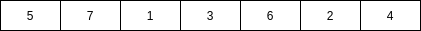

  - 初始状态有n=7个元素，所以 **第一轮需要对n个元素进行n-1次交换尝试**；
  - 所谓交换尝试即如果左边元素大于右边元素，即执行交换 => $A[j + 1] > A[j]$ 或 $A[j] > A[j - 1]$

- **第一轮**

  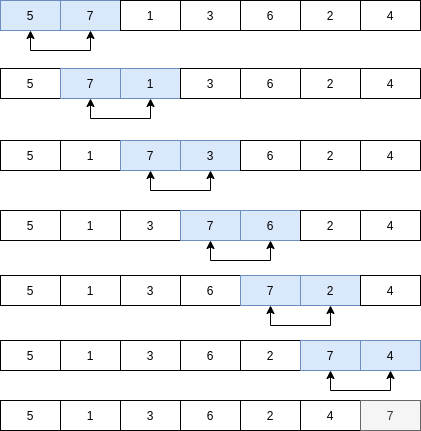

  - **第一轮** 结束就 **有一个数已经排好序** 了（它是数组中最大的元素，第一轮结束位于数组末尾），还剩n-1个元素未排序；
  - 所以 **第二轮需要对n-1个元素进行n-2次交换尝试**；

- **第二轮**

  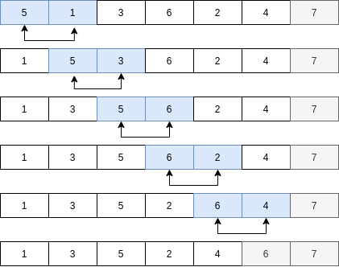

  - **第二轮** 结束 **有两个数已经排好序** 了，还剩n-2个元素未排序；
  - 所以 **第三轮需要对n-2个元素进行n-3次交换尝试**

- 之后的若干轮操作相同，此处省略

### 1.2 实现分析

对于一个长度位n的待排序数组A，我们作如下分析

- 根据上面的演示分析，对于一个长度为n的数组，我们需要n-1轮对其排好序；

  => 在代码实现部分，轮数对应于第一个for循环：

  ```python
  # 如果第一个for循环选择正向遍历，我们可以如下表示（我们后续讨论前者，后者不过是偏移不同而已）：
  for i in range(n - 1)    或   for i in range(1, n)
  
  # 如果第一个for循环选择反向遍历，我们可以如下表示（PPT中选择下面两种表示中的前面一种表示，我们后续讨论前者，后者不过是偏移不同而已）：
  for i in range(len(A) - 1, 0, -1)	或  for i in range(len(A) - 2, -1, -1)
  ```

- 对于第 i 轮，有m个数未排好序，对应于第二层for循环，至于具体如何表示，取决于第一层for循环如何表示（无论正向还是反向，**核心就是：本轮如果有m个元素待排序，第二个for循环就应该有m - 1次交换尝试**）：

  ```python
  # 如果第一个for循环选择正向遍历，则两层循环的表示如下：
  for i in range(n - 1):
      for j in range(n - i - 1):
  
  # 如果第一个for循环选择反向遍历，则两层循环的表示如下（PPT中选择如下表示）：
  for i in range(len(A) - 1, 0, -1):
      for j in range(i):
  ```

- 因为我们的目标是 **每轮将最大的数冒泡到末尾** ，所以对于循环内部，我们每次就是比较相邻两个数，如果左边的数大于右边的数，就交换两个数：

  ```python
  if A[j] > A[j + 1]:
      A[j], A[j + 1] = A[j + 1], A[j]
  ```

### 1.3 实现

```python
# 第一个for循环采用正向遍历的冒泡排序代码示例
def bubbleSort(A):
    n = len(A)
    for i in range(n - 1):
        for j in range(n - i - 1):
            if A[j] > A[j + 1]:
                A[j], A[j + 1] = A[j + 1], A[j]


# 第一个for循环采用反向遍历的冒泡排序代码示例
def bubbleSort2(A):
    n = len(A)
    for i in range(n - 1, 0, -1):
        for j in range(i):
            if A[j] > A[j + 1]:
                A[j], A[j + 1] = A[j + 1], A[j]


if __name__ == '__main__':
    A = [5, 7, 1, 3, 6, 2, 4]
    bubbleSort(A)
    print(A, "= [1, 2, 3, 4, 5, 6, 7]")

    A = [5, 7, 1, 3, 6, 2, 4]
    bubbleSort2(A)
    print(A, "= [1, 2, 3, 4, 5, 6, 7]")

```

## 2. 选择排序

主要思想：每轮依次 **从未排序部分选出一个最小的元素放置于未排序序列的第一个位置**。

> 注意：
>
> - PPT中没有统一，其实现刚好是反过来的，它每轮依次 **从未排序部分选出一个最大的元素放置于未排序序列的最后一个位置**
>
> - PPT中选择排序反向实现，插入排序又正向实现，这边统一都改成正向实现，比较好对比

### 2.1 简单演示

> - 白色背景表示未排序部分
> - 灰色背景表示已排序部分
> - 淡绿色指示下一个放置本轮最小元素的位置
> - 淡黄色指示本轮最小元素

- **初始状态**

  

  - 初始状态有n=7个元素，所以 **第一轮需要从n个元素选出一个最小的与第一个元素交换**；

- **排序过程**

  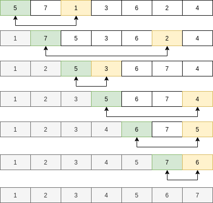

  - 每一轮都从未排序序列中选出一个最小的，与未排序序列中的第一个元素交换；
  - 共 **需n - 1轮**

### 2.2 实现分析

> PPT中的实现与下述过程基本相似，但是PPT的代码实现是，每轮选一个最大的放在未排序列表的最后

对于一个长度位n的待排序数组A，我们作如下分析：

- 根据上面的演示分析，对于一个长度为n的数组，我们需要n-1轮对其排好序；

  => 在代码实现部分，轮数对应于第一个for循环：

  ```python
  # 由于选择排序很直观就是一个从左往右的过程，所以一般第一个for循环都是正向遍历
  for i in range(n - 1)
  ```

- 对于第 i 轮，有m个数未排好序，对应于第二层for循环，具体表示如下（**核心就是：如果本轮有m个数未排好序，我们就让初始索引为第一个数，然后依次比对剩下的m-1个数有没有比初值小的**）：

  ```python
  for i in range(n - 1):
      minValueIndex = i
      for j in range(i + 1, n):
          if A[j] < A[minValueIndex]:
              minValueIndex = j
  ```

- 最后在每轮结束后进行交换：

  ```python
  for i in range(n - 1):
      minValueIndex = i
      for j in range(i + 1, n):
          if A[j] < A[minValueIndex]:
              minValueIndex = j
      if minValueIndex != i:
          A[i], A[minValueIndex] = A[minValueIndex], A[i]
  ```

### 2.3 实现

```python
def selectSort(A):
    n = len(A)
    for i in range(n - 1):
        minValueIndex = i
        for j in range(i + 1, n):
            if A[j] < A[minValueIndex]:
                minValueIndex = j
        if minValueIndex != i:
            A[i], A[minValueIndex] = A[minValueIndex], A[i]

if __name__ == '__main__':
    A = [5, 7, 1, 3, 6, 2, 4]
    selectSort(A)
    print(A, "= [1, 2, 3, 4, 5, 6, 7]")
```

## 3. 插入排序

主要思想：每轮 **从未排序部分取一个元素插入到已经排序好的队列中，保证新的元素插入之后的新队列依旧是有序的。**

### 3.1 简单演示

> - 白色背景表示未排序部分
> - 灰色背景表示已排序部分
> - 砖红色背景指示其是本轮待插入的目标元素
> - 淡黄色背景指示目标元素此次要对比的元素（淡换色背景的元素是上一轮排序的元素）

- **初始状态**

  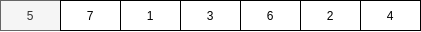

  - 初始状态有n=7个元素，初始时，第一个元素属于已经排好序的元素，所以 **第一轮需要将第二个元素插入到一排序的序列**；

- **第一轮**

  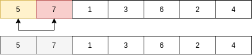

  ----

  

- **第二轮**

  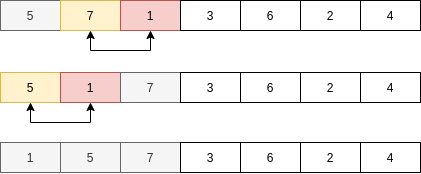

  -----

  

- **第三轮**

  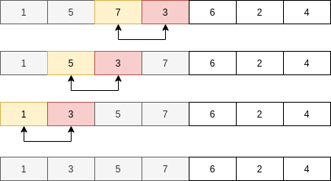

  ----

  

- 第四轮

  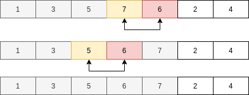

  ----

  

- 第五轮

  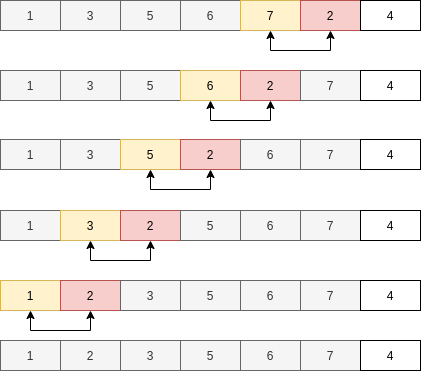

  ----

  

- 第六轮

  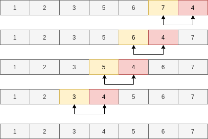

### 3.2 实现分析

对于一个长度位n的待排序数组A，我们作如下分析：

- 根据上面的演示分析，对于一个长度为n的数组，我们需要n-1轮对其排好序；

  => 在代码实现部分，轮数对应于第一个for循环：

  ```python
  # 由于选择排序很直观就是一个从左往右的过程，所以一般第一个for循环都是正向遍历
  for i in range(1, n)
  ```

- 对于第 i 轮，我们需要将下标为 i 的元素插入到 A[0 : i - 1] 组成的有序列表当中，具体表示如下（**核心就是：每次都和当前元素左边的元素比较，如果左边元素比当前元素大，就交换，直到遇到小于等于自己的元素，跳出第二层循环**）：

  ```python
  for i in range(1, n):
      curIndex = i
      for j in range(curIndex - 1, -1, -1):
          if A[j] > A[curIndex]:
              A[j], A[curIndex], curIndex = A[curIndex], A[j], j
          else:
  			break
  ```

### 3.3 实现

> 这个实现就和冒泡很像了，但是与冒泡相比，我们始终用一个下标跟踪我们当前要插入的元素

```python
def insertSort(A):
    n = len(A)
    for i in range(1, n):
        curIndex = i
        for j in range(curIndex - 1, -1, -1):
            if A[j] > A[curIndex]:
                A[j], A[curIndex], curIndex = A[curIndex], A[j], j
            else:
                break


if __name__ == '__main__':
    A = [5, 7, 1, 3, 6, 2, 4]
    insertSort(A)
    print(A, "= [1, 2, 3, 4, 5, 6, 7]")
```

## 4. 冒泡、选择、插入排序对比

|          | 主要思想                                                     | 实现                                                         |
| -------- | ------------------------------------------------------------ | ------------------------------------------------------------ |
| 冒泡排序 | 每轮依次 **从前往后** 比较相邻的两个元素，将两个元素中 **较大的排在后面** ， <br>**每一轮** 可以将当前 **未排序部分最大的置于最后**。（每轮通过冒泡的方式将当前未排序部分最大的元素冒出） | 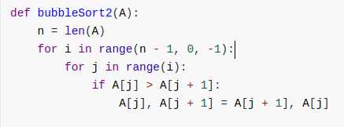 |
| 选择排序 | 每轮依次 **从未排序部分选出一个最小的元素放置于未排序序列的第一个位置**。 | 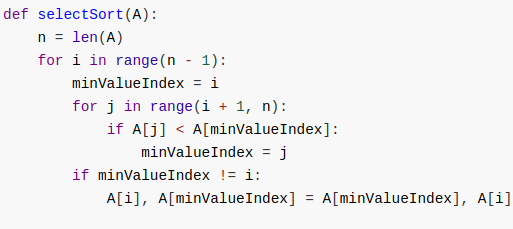 |
| 插入排序 | 每轮 **从未排序部分取一个元素插入到已经排序好的队列中，保证新的元素插入之后的新队列依旧是有序的。** | 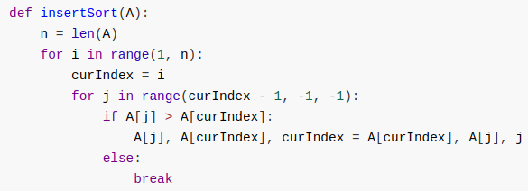 |

|          |                           代码特征                           | 是否稳定 | 最好     |   最坏   |   平均   |
| :------: | :----------------------------------------------------------: | :------: | -------- | :------: | :------: |
| 冒泡排序 | **只在第二层循环内进行交换尝试，第二个循环体前后都无需额外操作** |    是    | $O(n)$   | $O(n^2)$ | $O(n^2)$ |
| 选择排序 | **在第二个层循环体之前记录初始化最小数下标，第二个循环体内更新该坐标，最后在第二个循环体结束的时候使用该坐标进行交换操作** |    否    | $O(n^2)$ | $O(n^2)$ | $O(n^2)$ |
| 插入排序 | **在第二层循环体之前记录当前要插入的元素的下标，在第二个循环体内部用类冒泡的方式将其插入到合适的位置，第二个循环体之后无需操作** |    是    | $O(n)$   | $O(n^2)$ | $O(n^2)$ |

> - 上述所说代码特征是一些常用实现的写法有的，但是也有一些奇葩实现法可能特征不一样（PPT中的插入排序实现就和这边特征不一样）